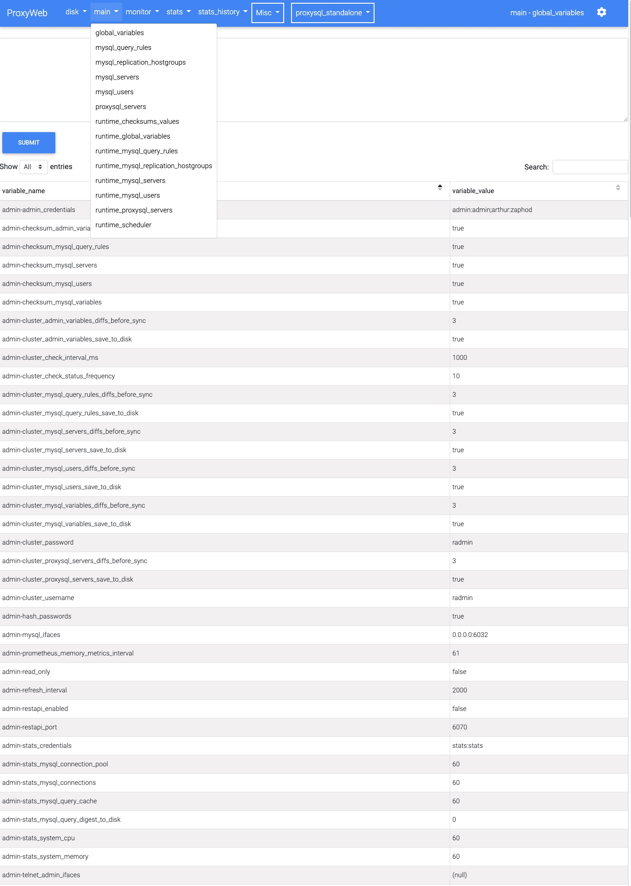
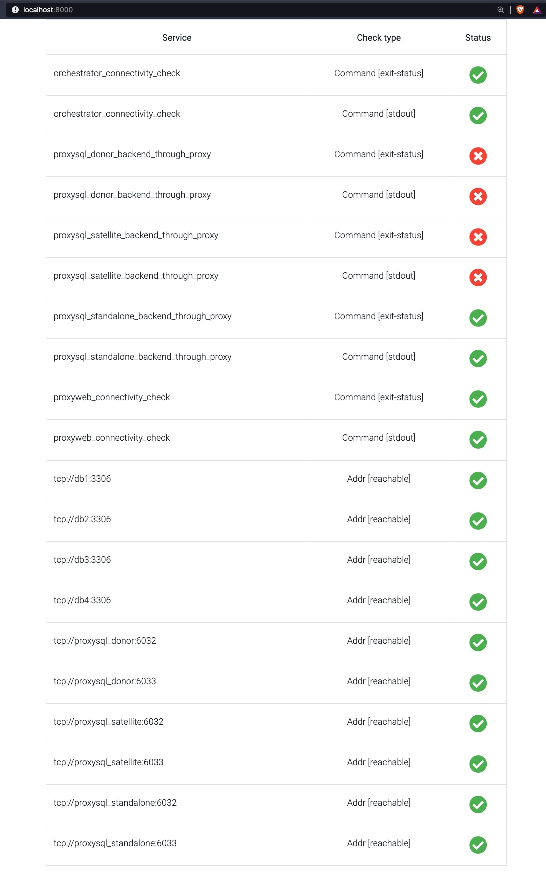

# ProxyWeb
Open Source Web UI for [ProxySQL](https://proxysql.com/)





**Current features include**:
- Clean and responsive design
- [Multi-server support](misc/images/ProxyWeb_servers.jpg)
- [Configurable reporting](misc/images/ProxyWeb_report.jpg)
- Global and per-server options
- Hide unused tables (global or per-server basis)
- Sort content by any column (asc/desc)
- Online config editor
- Narrow-down content search
- Paginate content


# Setup

## Install ProxyWeb next to ProxySQL
With Doc
ker:
```
docker run -h proxyweb --name proxyweb --network="host" -d proxyweb/proxyweb:latest
```
## Install it as a systemd service (Ubuntu)
```
git clone https://github.com/edmodo/proxyweb
cd proxyweb
make install
```
Visit  [http://ip_of_the_host:5000/setting/edit](http://ip_of_the_host:5000/setting/edit) first and adjust the credentials if needed.
The default connection is the local one with the default credentials.

## Install ProxyWeb to work with remote ProxySQL servers
### Configure ProxySQL for remote admin access

ProxySQL only allows local admin connections by default.

In order to enable remote connections you have to enable it in ProxySQL:

```
set admin-admin_credentials="admin:admin;radmin:radmin";
load admin variables to runtime; save admin variables to disk;
```

After this we can connect to the ProxySQL with:
- username: radmin
- password: radmin
- port: 6032 (default)

Run:
```
docker run -h proxyweb --name proxyweb -p 5000:5000 -d proxyweb/proxyweb:latest

or

git clone https://github.com/edmodo/proxyweb.git
cd proxyweb
make  proxyweb-run
```

Visit [http://ip_of_the_host:5000/setting/edit](http://ip_of_the_host:5000/setting/edit) first and edit the `servers`
section.

---


## Testing with docker-compose

Setting up a fully functional MySQL/ProxySQL/ProxyWeb/Orchestrator sandbox is super-easy with docker-compose:

```
git clone https://github.com/edmodo/proxyweb.git
cd proxyweb/docker-compose
make up

or

git clone https://github.com/edmodo/proxyweb.git
cd proxyweb
make  compose-up
```
This will start  the following services:

| Service  | Host Port | Container | Container port
| :---         |     :---:      |          :---: |          :---: |
| MySQL source   |   23306   | db1    |3306|
| MySQL replica   |   23307   | db2    |3306|
| MySQL replica   |   23308   | db3    |3306|
| MySQL replica   |   23309   | db4    |3306|
| ProxySQL   | admin: 16032, app: 13306     | proxysql_donor    |admin: 6032, app: 3306 |
| ProxySQL   | admin: 16033, app: 13307     | proxysql_satellite   |admin: 6032, app: 3306 |
| ProxySQL   | admin: 16034, app: 13308     | proxysql_standalone    |admin: 6032, app: 3306 |
| Orchestrator   | 3000     | orchestrator     | 3000|
| Goss   | 8000     | goss     | 8000|
| ProxyWeb   | 5000     | proxyweb    | 5000|

You can add sysbench to the test cluster:
```
make sysbench-up
```
Or stop sysbench:
```
make sysbench-down
```
The sysbench output can be access with:
```
make sysbench-logs
```

After all the containers are up and  running, go to:
[http://127.0.0.1:5000/proxysql_donor/main/global_variables/](http://127.0.0.1:5000/proxysql_donor/main/global_variables//)

In this example we're going to set up ProxySQL with 3 MySQL backend servers with some basic query routing.
Once this is done, another ProxySQL server will be added as a [ProxySQL cluster](https://proxysql.com/blog/proxysql-cluster/)

### Configure the proxysql_donor:
You can start executing these, check the tables after each section:
```buildoutcfg
### configure the monitoring user:
UPDATE global_variables SET variable_value='monitor' WHERE variable_name='mysql-monitor_username';
UPDATE global_variables SET variable_value='monitor' WHERE variable_name='mysql-monitor_password';


### Increase the timeouts so ProxySQL won't consider the backend servers unhealhy when stopping/starting the containers
UPDATE global_variables SET variable_value='2000' WHERE variable_name IN ('mysql-monitor_connect_interval','mysql-monitor_ping_interval','mysql-monitor_read_only_interval');
UPDATE global_variables SET variable_value='100' WHERE variable_name IN ('mysql-connect_retries_on_failure','monitor_ping_max_failures');

# Don't add the source as a reader
UPDATE global_variables SET variable_value='false' WHERE variable_name = 'mysql-monitor_writer_is_also_reader';


LOAD MYSQL VARIABLES TO RUNTIME;
SAVE MYSQL VARIABLES TO DISK;

### Create a replication hostgroup
INSERT INTO mysql_replication_hostgroups (writer_hostgroup,reader_hostgroup,comment) VALUES (1,2,'cluster1');


### add the MySQL backend servers
INSERT INTO mysql_servers(hostgroup_id,hostname,port) VALUES (1,'db1',3306);
INSERT INTO mysql_servers(hostgroup_id,hostname,port) VALUES (1,'db2',3306);
INSERT INTO mysql_servers(hostgroup_id,hostname,port) VALUES (1,'db3',3306);
INSERT INTO mysql_servers(hostgroup_id,hostname,port) VALUES (1,'db4',3306);

LOAD MYSQL SERVERS TO RUNTIME;
SAVE MYSQL SERVERS TO DISK;


### Add the MySQL user to the ProxySQL

INSERT INTO mysql_users(username,password,default_hostgroup) VALUES ('world','world',1);
LOAD MYSQL USERS TO RUNTIME;
SAVE MYSQL USERS TO DISK;

### Set up a query rule that will send all ^SELECT to the reader hostgroup=2
INSERT INTO mysql_query_rules (rule_id,active,match_digest,destination_hostgroup,apply)
VALUES
(1,1,'^SELECT.*FOR UPDATE',1,1),
(2,1,'^SELECT',2,1);
LOAD MYSQL QUERY RULES TO RUNTIME;
SAVE MYSQL QUERY RULES TO DISK;
```

A basic ProxySQL setup with query routing is done, it's time to test it (run this from outside the docker containers):
```
mysql -vvv -uworld -pworld -P 13306 -h 127.0.0.1  world -e "insert into city (Name, CountryCode, District, Population) values ('Eger', 'HUN', 'Heves', 61234);"
```
```
mysql -vvv -uworld -pworld -P 13306 -h 127.0.0.1  world -e "select * from world.city where name = 'Budapest';"
```
You can observe that the select was redirected to the hostgroup=2 which is the reader.
http://127.0.0.1:5000/proxysql_donor/stats/stats_mysql_query_digest/

#### Let's setup the ProxySQL cluster:

Run the following on the  [proxysql_donor](http://127.0.0.1:5000/proxysql_donor/main/global_variables/) first THEN on the [proxysql_satellite](http://127.0.0.1:5000/proxysql_satellite/main/global_variables/).
The order is important as the 'satellite' node will start syncing the configs and it will also pull the runtime_proxysql_servers table.
```buildoutcfg
UPDATE global_variables SET variable_value='radmin' WHERE variable_name = 'admin-cluster_username';
UPDATE global_variables SET variable_value='radmin' WHERE variable_name = 'admin-cluster_password';

LOAD ADMIN VARIABLES TO RUNTIME;
SAVE ADMIN VARIABLES TO DISK;

insert into proxysql_servers values ('proxysql_donor','6032','','donor');
LOAD PROXYSQL SERVERS TO RUNTIME;
SAVE PROXYSQL SERVERS TO DISK;
```

Check these proxysql_satellite runtime configs:
- [servers](http://127.0.0.1:5000/proxysql_satellite/main/runtime_mysql_servers/)
- [users](http://127.0.0.1:5000/proxysql_satellite/main/runtime_mysql_users/)
- [query_rules](http://127.0.0.1:5000/proxysql_satellite/main/runtime_mysql_query_rules/)
- [connection_pool](http://127.0.0.1:5000/proxysql_satellite/stats/stats_mysql_connection_pool/)

All the configs from the proxysql_donor are there.

Let's add a new rule to the [proxysql_donor](http://127.0.0.1:5000/proxysql_donor/main/mysql_query_rules/
):
```
INSERT INTO mysql_query_rules (active,match_digest,multiplex,cache_ttl) VALUES
('1','^SELECT @@max_allowed_packet',2,60000);
LOAD MYSQL QUERY RULES TO RUNTIME;
SAVE MYSQL QUERY RULES TO DISK;
```

The rule will appear in the proxysql_satellite [runtime_mysql_query_rules](http://127.0.0.1:5000/proxysql_satellite/main/runtime_mysql_query_rules/).

The  proxysql_satellite is running on port 13307, you can start running  queries on this ProxySQL as well.
```
mysql -vvv -uworld -pworld -P 13307 -h 127.0.0.1  world -e "insert into city (Name, CountryCode, District, Population) values ('Eger', 'HUN', 'Heves', 61234);"

mysql -vvv -uworld -pworld -P 13307 -h 127.0.0.1  world -e "select * from world.city where name = 'Budapest';"
```

The proxysql_standalone ProxySQL instance have all the above (mysql_servers, user, routing) minus the cluster config readily available when it starts.

###Orchestrator

Orchestrator is running at  http://127.0.0.1:3000


Discover the MySQL topology:
```buildoutcfg
cd docker-compose && docker-compose exec orchestrator /usr/local/orchestrator/orchestrator -c discover -i db1
```

Or on the Orchestrator Web UI http://localhost:3000/web/discover

Failover demo video:

[](https://www.youtube.com/watch?v=0LT4tfzXf58)


Recreating the demo env is recommended:
```buildoutcfg
#stopping the make compose-up by pressing ctrl+c twice
make compose-destroy
make compose-up
```

###Goss
Goss is a YAML based serverspec alternative tool for validating a server’s configuration.
For the sake of simplicity a small web frontend was added in order to represent the health/status of our services.

It's running at  http://127.0.0.1:8000

Some  services  are in `failed` status initially as the purpose of this tutorial is to set the donor and satellite ProxySQLs up.
You can check if the setup was successful by visiting this page again.

The status checks are executed when the page is hit/reloaded.




---
## Miscellaneaous
#### List of parameters can be passed to the ProxyWeb Docker container

- WEBSERVER_PORT = 8001 (default = 5000)
- WEBSERVER_WORKERS = 4 (default = 2)
- WEBSERVER_THREADS = 4 (default = 2)


### Config file
example:
```buildoutcfg
global:
  hide_tables: [ '' ]
  default_server: "proxysql_donor"
  read_only: true

servers:
  proxysql_donor:
    dsn:
      - { "host": "172.17.0.1", "user": "radmin", "passwd": "radmin", "port": "16032", "db": "main" }

    read_only: false
  proxysql_satellite:
    dsn:
      - { "host": "172.17.0.1", "user": "radmin", "passwd": "radmin", "port": "16033", "db": "main" }
    read_only: true

  proxysql_standalone:
    dsn:
      - { "host": "172.17.0.1", "user": "arthur", "passwd": "zaphod", "port": "16034", "db": "main" }
    read_only: false
    hide_tables: [ 'mysql_aws_aurora_hostgroups', 'mysql_server_aws_aurora_failovers', 'mysql_server_aws_aurora_check_status', 'mysql_server_group_replication_log', 'mysql_galera_hostgroups', 'runtime_mysql_galera_hostgroups', 'mysql_server_aws_aurora_log' , 'mysql_server_aws_aurora_log', 'runtime_mysql_aws_aurora_hostgroups', 'runtime_mysql_server_aws_aurora_failovers', 'runtime_mysql_server_aws_aurora_check_status', 'runtime_mysql_server_group_replication_log', 'runtime_mysql_server_aws_aurora_log', 'runtime_mysql_server_aws_aurora_log', 'mysql_collations', 'mysql_firewall_whitelist_rules', 'mysql_firewall_whitelist_sqli_fingerprints', 'mysql_firewall_whitelist_users', 'mysql_query_rules_fast_routing', 'mysql_group_replication_hostgroups', 'restapi_routes', 'runtime_mysql_collations', 'runtime_mysql_firewall_whitelist_rules', 'runtime_mysql_firewall_whitelist_sqli_fingerprints', 'runtime_mysql_firewall_whitelist_users', 'runtime_mysql_query_rules_fast_routing', 'runtime_mysql_group_replication_hostgroups', 'runtime_restapi_routes', 'scheduler','mysql_server_galera_log' ]

misc:
  adhoc_report:
    - { "title": "Top 10 SELECTs by exec_time",
        "info": "Looking at queries with big exec_time(number of execution * time to run) is a good point to start when optimizing queries.",
        "sql": "SELECT digest,username,schemaname, SUBSTR(digest_text,0,80),count_star,sum_time, count_star*sum_time as exec_time FROM stats_mysql_query_digest WHERE digest_text LIKE 'SELECT%' ORDER BY count_star*sum_time DESC LIMIT 10;"
    }

    - { "title": "Top 10 SELECTs by sum_time",
        "info": "While eliminating the long running queries is a usually a good idea, these queries don't always have a huge impact on the overall latency (the user experience).",
        "sql": "SELECT digest,username,schemaname, SUBSTR(digest_text,0,80),count_star,sum_time FROM stats_mysql_query_digest WHERE digest_text LIKE 'SELECT%' ORDER BY sum_time DESC LIMIT 10;"
    }

    - { "title": "Top 10 SELECTs by count_star",
        "info": "Caching/rewriting/even removing  frequently running queries can improve the overall performance significantly. ProxySQL support all the mentioned methods. Example: it's a good idea to cache queries often issued by connectors like `^SELECT @@max_allowed_packet`",
        "sql": "SELECT digest,username,schemaname, SUBSTR(digest_text,0,80),count_star,sum_time FROM stats_mysql_query_digest WHERE digest_text LIKE 'SELECT%' ORDER BY count_star DESC LIMIT 10;"
    }

    - { "title": "Schemas with the most DMLs",
        "info": "This helps identify the schemas getting the most writes",
        "sql": "SELECT schemaname, sum(sum_time) as time_spent, sum(count_star) as sum_count_star   FROM stats_mysql_query_digest where digest_text LIKE 'INSERT%' or digest_text like 'DELETE%' or digest_text like 'UPDATE%' group by schemaname order by time_spent desc;" }

    - { "title": "Top 5 schemas by exec_time",
        "info": "List of the schemas with the highest overall exec_time",
        "sql": "SELECT schemaname, count_star*sum_time as exec_time   FROM stats_mysql_query_digest group by schemaname order by count_star*sum_time desc limit 5;" }

    - { "title": "Send the top 5 SELECTS to the readers",
        "info": "Don't send  selects to the readers without checking the impact first as the app might read back the data immediately writing it.",
        "sql": "select \"replace into mysql_query_rules (username,schemaname,destination_hostgroup,active,apply,digest) values('\" || st.username || \"','\" || st.schemaname || \"',12,1,1,'\" ||  st.digest || \"');\" from stats_mysql_query_digest st left join runtime_mysql_query_rules qr on st.digest = qr.digest where  qr.rule_id is null  and digest_text LIKE 'SELECT%' ORDER BY count_star desc limit 5;" }

flask:
  SECRET_KEY: "12345678901234567890"
  SEND_FILE_MAX_AGE_DEFAULT: 0
  TEMPLATES_AUTO_RELOAD: "True"
```
#### Global
The global `read_only` and `hide_tables` will be only used if they are not defined under the servers

| Veriable  | values| effect
| :---         |     :---:      |      :---:      |
| read_only   | true/false |hides the sql editor   |
| hide_tables   |  array: ['table1','table2']    | hides the tables from the ProxyWeb menus |
| default_server   |   servers.${servername}   | which server will be shown as default upon startup|

#### Servers
List of servers and credentials used for establish connection to ProxySQLs
The `read_only` and `hide_tables` variables added here have preference over the global one.

#### Misc
Configure the adhoc reports here

#### Flask
Used to configure Flask, don't touch.
A random `SECRET_KEY` is generated when using the dockerized ProxyWeb or when running `make install`.


### Features on the roadmap
- ability to edit tables
- authentication
- more advanced input validation
---
### Credits:

Thanks for Rene Cannao and the SysOwn team for the wonderful [ProxySQL](https://proxysql.com/).

ProxyWeb is using the following projects:
- Bootstrap 4.4.1
- Mdbootstrap 4.16
- Font Awesome 5.8.2
- Google Fonts
- dbdeployer
