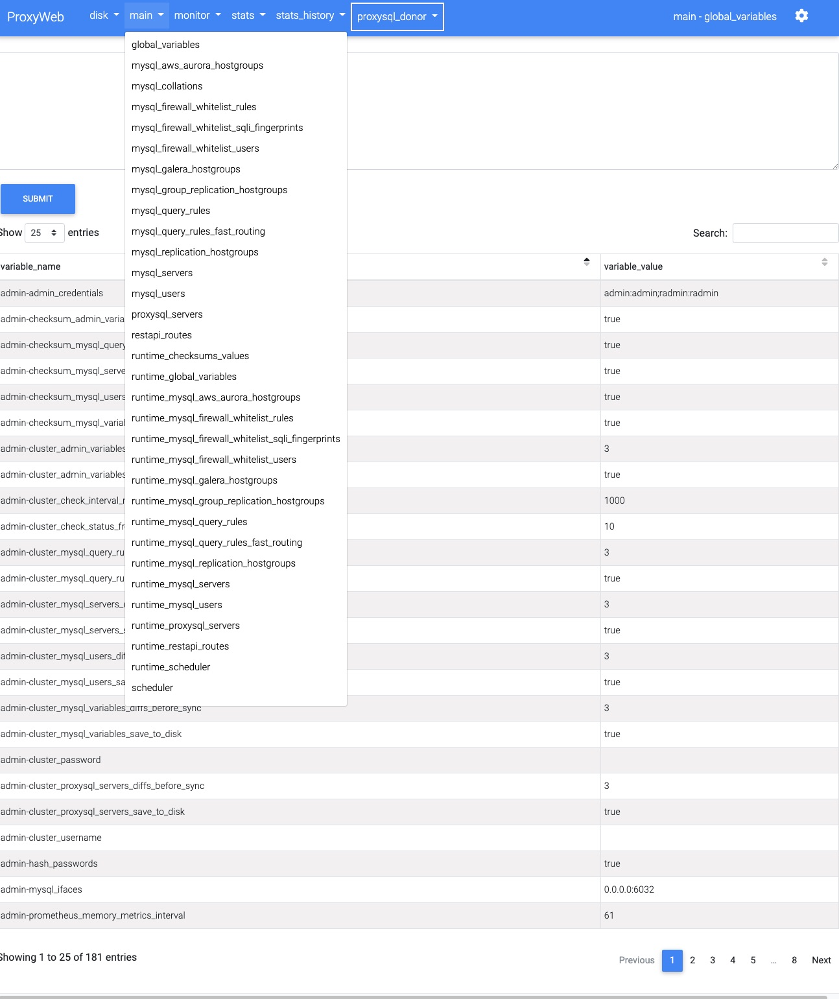

# ProxyWeb
Open Source Web UI for [ProxySQL](https://proxysql.com/)




**Current features include**:
- Clean and responsive design
- multi-server support
- global and per-server options
- hide unused tables (global or per-server basis)   
- Sort content by any column (asc/desc)
- online config editor
- Narrow-down content search 
- Paginate content


# Setup 

## Install ProxyWeb next to ProxySQL
With Docker:
```
docker run -h proxyweb --name proxyweb --network="host" -d proxyweb/proxyweb:latest
```
## Install it as a systemd service (Ubuntu)
```
git clone https://github.com/edmodo/proxyweb
cd proxyweb
make install 
```
Visit  [http://ip_of_the_host:5000/setting/edit](http://ip_of_the_host:5000/setting/edit) first and adjust the credentials if needed. 
The default connection is the local one with the default credentials.

## Install ProxyWeb to work with remove ProxySQL servers
### Configure ProxySQL for remote admin access

ProxySQL only allows local admin connections by default.

In order to enable remote connections you have to enable it in ProxySQL:

```
set admin-admin_credentials="admin:admin;radmin:radmin";
load admin variables to runtime; save admin variables to disk;
```

After this we can connect to the ProxySQL with:
- username: radmin
- password: radmin 
- port: 6032 (default)

Run:
```
docker run -h proxyweb --name proxyweb -p 5000:5000 -d proxyweb/proxyweb:latest

or 

git clone https://github.com/edmodo/proxyweb.git
cd proxyweb
make  proxyweb-run
```

Visit [http://ip_of_the_host:5000/setting/edit](http://ip_of_the_host:5000/setting/edit) first and edit the `servers` 
section.

--- 


## Testing with docker-compose

Setting up a fully functional MySQL/ProxySQL/ProxyWeb sandbox is super-easy with docker-compose:

```
git clone https://github.com/edmodo/proxyweb.git
cd proxyweb/docker-compose up 

or

git clone https://github.com/edmodo/proxyweb.git
cd proxyweb 
make  compose-up
```
This will start  the following services:

| Service  | Port | Container |
| :---         |     :---:      |          :---: |
| MySQL source   |   19327   | dbtest    |
| MySQL replica   |   19328   | dbtest    |
| MySQL replica   |   19328   | dbtest    |
| ProxySQL   | admin: 16032, app: 13306     | proxysql_donor    |
| ProxySQL   | admin: 16033, app: 13307     | proxysql_satellite   |
| ProxySQL   | admin: 16034, app: 13308     | proxysql_standalone    |
| ProxyWeb   | 5000     | proxyweb    |

After all the containers are up and  running, go to:
[http://127.0.0.1:5000/proxysql_donor/main/global_variables/](http://127.0.0.1:5000/proxysql_donor/main/global_variables//)

In this example we're going to set up ProxySQL with 3 MySQL backend servers with some basic query routing. 
Once this is done, another ProxySQL server will be added as a [ProxySQL cluster](https://proxysql.com/blog/proxysql-cluster/)   

### Configure the proxysql_donor:  
You can start executing these, check the tables after each section:
```
### configure the monitoring user: 
UPDATE global_variables SET variable_value='msandbox' WHERE variable_name='mysql-monitor_username';
UPDATE global_variables SET variable_value='msandbox' WHERE variable_name='mysql-monitor_password';


### Increase the timeouts so ProxySQL won't consider the backend servers unhealhy when stopping/starting the containers
UPDATE global_variables SET variable_value='2000' WHERE variable_name IN ('mysql-monitor_connect_interval','mysql-monitor_ping_interval','mysql-monitor_read_only_interval');
UPDATE global_variables SET variable_value='100' WHERE variable_name IN ('mysql-connect_retries_on_failure','monitor_ping_max_failures');

LOAD MYSQL VARIABLES TO RUNTIME;
SAVE MYSQL VARIABLES TO DISK;

### Create a replication hostgroup
INSERT INTO mysql_replication_hostgroups (writer_hostgroup,reader_hostgroup,comment) VALUES (1,2,'cluster1');


### add the MySQL backend servers 
INSERT INTO mysql_servers(hostgroup_id,hostname,port) VALUES (1,'172.17.0.1',19327);
INSERT INTO mysql_servers(hostgroup_id,hostname,port) VALUES (1,'172.17.0.1',19328);
INSERT INTO mysql_servers(hostgroup_id,hostname,port) VALUES (1,'172.17.0.1',19329);

LOAD MYSQL SERVERS TO RUNTIME;
SAVE MYSQL SERVERS TO DISK;


### Add the MySQL user to the ProxySQL

INSERT INTO mysql_users(username,password,default_hostgroup) VALUES ('msandbox','msandbox',1);
LOAD MYSQL USERS TO RUNTIME;
SAVE MYSQL USERS TO DISK;

### Set up a query rule that will send all ^SELECT to the reader hostgroup=2 
INSERT INTO mysql_query_rules (rule_id,active,match_digest,destination_hostgroup,apply)
VALUES
(1,1,'^SELECT.*FOR UPDATE',1,1),
(2,1,'^SELECT',2,1);
LOAD MYSQL QUERY RULES TO RUNTIME;
SAVE MYSQL QUERY RULES TO DISK; 
```

A basic ProxySQL setup with query routing is done, it's time to test it (run this from outside the docker containers):
```
mysql -vvv -u msandbox -pmsandbox -P 13306 -h 127.0.0.1  world -e "insert into city (Name, CountryCode, District, Population) values ('Eger', 'HUN', 'Heves', 61234);"
```
```
mysql -vvv -u msandbox -pmsandbox -P 13306 -h 127.0.0.1  world -e "select * from world.city where name = 'Budapest';"
```
You can observe that the select was redirected to the hostgroup=2 which is the reader.
http://127.0.0.1:5000/proxysql_donor/stats/stats_mysql_query_digest/

####Let's setup the ProxySQL cluster:

Run the following on the  [proxysql_donor](http://127.0.0.1:5000/proxysql_donor/main/global_variables/) first THEN run these on the [proxysql_satellite](http://127.0.0.1:5000/proxysql_satellite/main/global_variables/).
The order is important as one the 'satellite' node will start syncing the configs it will also pull the proxysql_servers list.
```
UPDATE global_variables SET variable_value='radmin' WHERE variable_name = 'admin-cluster_username';
UPDATE global_variables SET variable_value='radmin' WHERE variable_name = 'admin-cluster_password';

LOAD ADMIN VARIABLES TO RUNTIME;
SAVE ADMIN VARIABLES TO DISK;

insert into proxysql_servers values ('172.17.0.1','16032','','donor');
LOAD PROXYSQL SERVERS TO RUNTIME;
SAVE PROXYSQL SERVERS TO DISK;
```

Check the proxysql_satellite runtime config:
- [servers](http://127.0.0.1:5000/proxysql_satellite/main/runtime_mysql_servers/)
- [users](http://127.0.0.1:5000/proxysql_satellite/main/runtime_mysql_users/)
- [query_rules](http://127.0.0.1:5000/proxysql_satellite/main/runtime_mysql_query_rules/)
- [connection_pool](http://127.0.0.1:5000/proxysql_satellite/stats/stats_mysql_connection_pool/)

All the config from the proxysql_donor is there. 

Let's add a new rule to the [proxysql_donor](http://127.0.0.1:5000/proxysql_donor/main/mysql_query_rules/
):
```
INSERT INTO mysql_query_rules (active,match_digest,multiplex,cache_ttl) VALUES
('1','^SELECT @@max_allowed_packet',2,60000);
LOAD MYSQL QUERY RULES TO RUNTIME;
SAVE MYSQL QUERY RULES TO DISK; 
```

The rule will appear in the proxysql_satellite [runtime_mysql_query_rules](http://127.0.0.1:5000/proxysql_satellite/main/runtime_mysql_query_rules/).

The  proxysql_satellite is running on port 13307, you can start running  queries on this ProxySQL as well.
```
mysql -vvv -u msandbox -pmsandbox -P 13307 -h 127.0.0.1  world -e "insert into city (Name, CountryCode, District, Population) values ('Eger', 'HUN', 'Heves', 61234);"

mysql -vvv -u msandbox -pmsandbox -P 13307 -h 127.0.0.1  world -e "select * from world.city where name = 'Budapest';"
```

The proxysql_standalone ProxySQL instance have all the above (mysql_servers, user, routing) minus the cluster config readily available when it starts.


---
## Miscellaneaous 
#### List of parameters can be passed to the ProxyWeb Docker container

- WEBSERVER_PORT = 8001 (default = 5000)
- WEBSERVER_WORKERS = 4 (default = 2)
- WEBSERVER_THREADS = 4 (default = 2)


##Features on the roadmap
- ability to edit tables
- report menu
- authentication
- more advanced input validation
---
##Credits:

Thanks for Rene Cannao and the SysOwn team for the wonderful [ProxySQL](https://proxysql.com/).

ProxyWeb is using the following projects:
- Bootstrap 4.4.1
- Mdbootstrap 4.16
- Font Awesome 5.8.2
- Google Fonts
- dbdeployer

